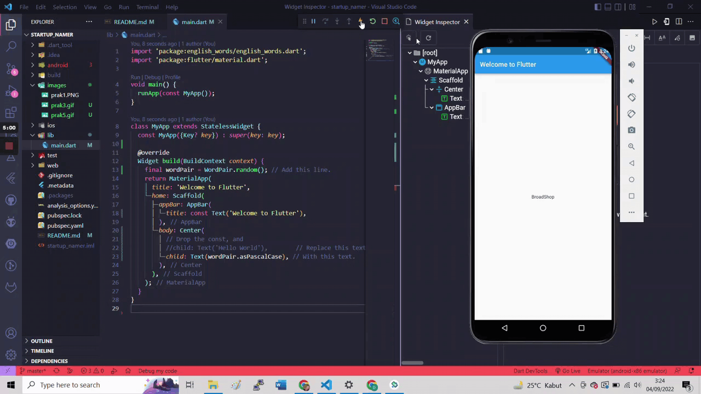
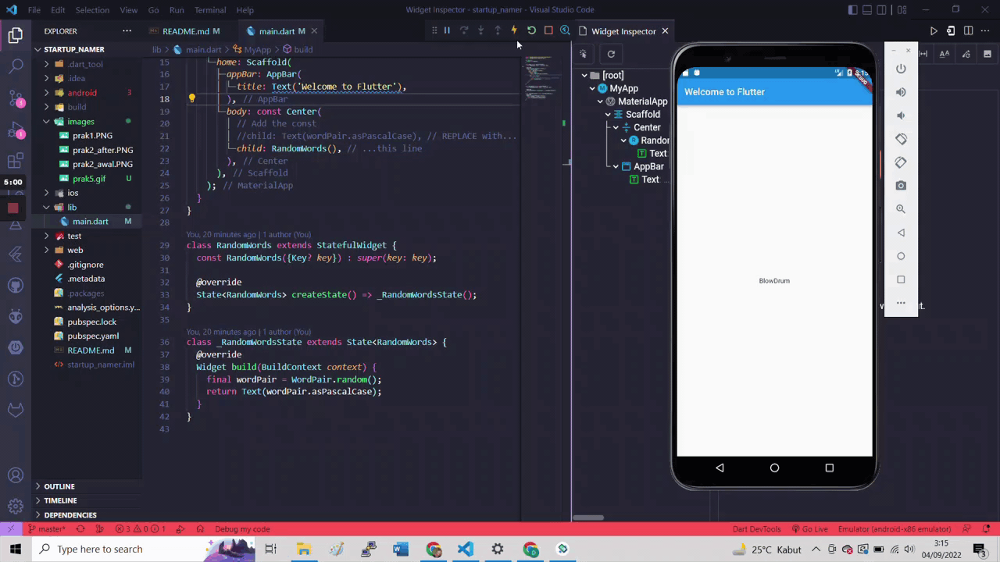

# startup_namer

A new Flutter project.

## Create the starter Flutter app

Program 'Hello World' dengan method build dengan kembalian MaterialApp yang memiliki widget Scaffold yang juga memiliki widget lain yaitu AppBar dan Body.

## Use an external package

Program ini menggunakan eksternal package yaitu english_words. Install melalui command line 'flutter pub add english_words' kemudian import pada main.dart. Terdapat instansiasi class WordPair dari english words.Object yang telah dibuat ditampilkan dalam bentuk Text 

## Add a stateful widget
Tampilan Awal

Perbedaan terjadi pada pemecahan kedalam widget baru yaitu RandomWords. Kemudian widget tersebut ditampilkan kembali dalam bentuk widget RandomWords di main dart.

## Create an infinite scrolling ListView

Pada langkah ini membuat seluruh layar berisi random english words dalam bentuk ListView.  Pada tampilan listview terdapat memiliki garis kecil yaitu akibat dari adanya Devider. Divider akan muncul ketika indeks bernilai ganjil. Jika data tidak cukup maka akan mengenerate word sehingga kata yang tampil akan sangat banyak(infinite)

