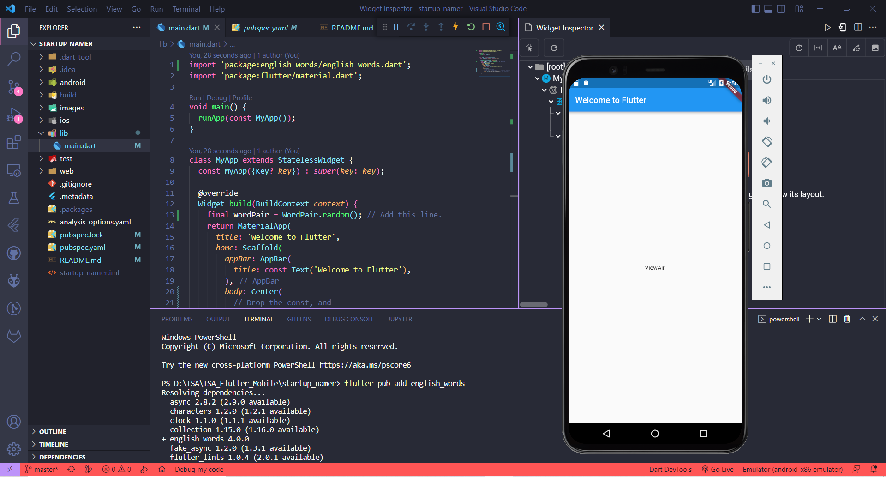
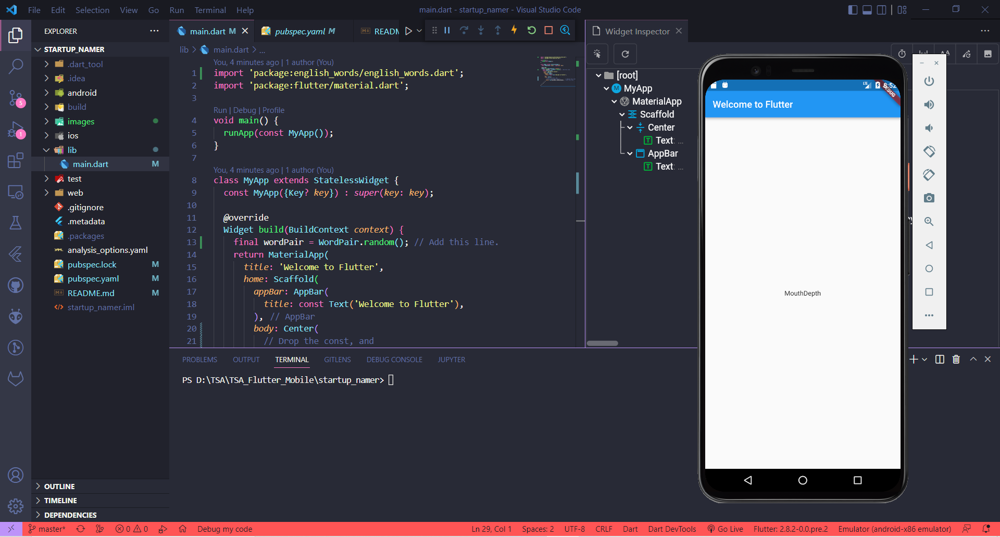

# startup_namer

A new Flutter project.

## Create the starter Flutter app

## Use an external package
Tampilan Awal

Setelah Hot Reload

## Use an external package
Tampilan Awal

Setelah Hot Reload

